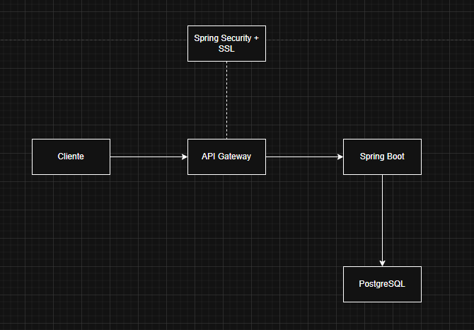
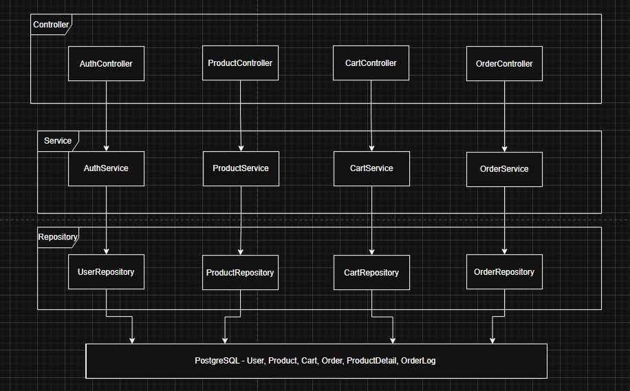

# DOSW_ParcialT2_DanielRayo_DanielPeña

## Parte Teórica

### 1. Matriz de Trazabilidad

[Ver Matriz de Trazabilidad](./docs/Matriz de Trazabilidad preparcial.xlsx)

### 2. Explique la diferencia entre Validaciones de input y Validaciones de negocio
La principal diferencia entre las validaciones de input y de negocio es que como su nombre lo indica
las validaciones de input se enfocan en lo que en si el sistema espera, por ejemplo un integer y no un
String, mientras que las validaciones de negocio se enfocan en reglas de negocio como puede ser que el
email no exista ya dentro de la base de datos

### 3. Explique la diferencia entre autenticación, autorización e integridad.
Una autenticación es el proceso de vrificar la identidad de un usuario  , mirentras que una autorización 
ocurre depues de la autenticación y sirve para dar permisoso o definicion de roles en cambio una integridad
es la seguridad de que los datos no se modificaran de marena errornea 

### 4. Genere el diagrama de componentes general del sistema ECIXPRESS

### 5. ¿Qué problemas pueden surgir si no se separan correctamente las capas dentro de un proyecto de software?

Alto acoplamiento , Baja Mantenibilidad , dificultada para escalar , problemas en pruebas y codigo 

### 6. Genere el diagrama de componentes específicos del sistema ECIXPRESS

### 7. ¿Cuáles son las diferencias entre un validador, una utilidad y un servicio?
Un validador es el ecargado de verificar que los datos cumplan x reglas , una ultilidad es donde se contienen las 
funciones reutilizables y un sercivicio es una logica de negocio donde se hacen las operaciones entre clases

### 8. Genere el diagrama de clases de los modelos y responda: ¿Qué patrón de software usaría para manejar los estados del pedido y por qué?

**Patrones de diseño implementados:**

| Patrón | Clase | Justificación |
|---|---|---|
| Builder | `Cart`, `Order` | Objetos complejos con muchos campos opcionales. Permite construir el objeto paso a paso sin constructores gigantes. |
| Singleton | `JwtService`, `SecurityConfig` | Solo debe existir una instancia de configuración de seguridad y generación de tokens en toda la aplicación. |
| Strategy | `PaymentStrategy` | Permite intercambiar la lógica de pago (aprobado/rechazado) sin modificar el código de `OrderService`. Abierto a extensión, cerrado a modificación. |
| Factory Method | `UserFactory` | Centraliza la creación de usuarios con diferentes roles (USER/ADMIN) sin exponer la lógica de construcción al exterior. |

---

### 9. Genere el diagrama entidad-relación para el marco relacional de persistencia

### 10.Proponga 2 índices que mejoren el rendimiento de las consultas de ECIXPRESS y establezca con un criterio técnico el porque dan valor a la solución
Indicar sobre user_id en la tabla de pedidos (orders):asi nos permite consultar de manera mas rapida los perdidos del usuario
Indice sobre product_id en la tabla de detalles del pedido: Optimiza las consultas relacionadas con productos dentro de estos pedidos (el carrito )
### 11.Como parte de la solución, es fundamental definir un conjunto robusto de pruebas que garantice la calidad y correcto funcionamiento de las funcionalidades expuestas en el sistema. Dado el enfoque de transparencia con el cliente, se requiere evidenciar cómo se desarrollaría la funcionalidad de “Solicitar pedido” siguiendo el enfoque de TDD (Test Driven Development). En este contexto, se espera que usted:

#### Describa cómo se aplican las fases de TDD (Red, Green, Refactor) en la implementación de esta funcionalidad.
- Para nuestro caso la manera de aplicar TDD va a ser inicialmente definiendo pruebas que vayan a fallar inicialmente
pudiendo crear un carrito con algunos productos quemados e intentar crear el pedido, luego cuando ya todo funcione ver
como es el comportamiento del mismo al lograr aceptar la prueba para finalmente
hacer refactor intentando ajustarlo lo mejor posible a la estructura pensada y repetir

#### Defina los casos de prueba iniciales antes de la implementación, contemplando tanto escenarios exitosos como de error.
- inicialmente se debe crear un usuario y un carrito con productos, posteriormente se debe validar que el pedido se crea exitosamente
- otra prueba puede ser un caso de fallo donde el carrito esté vacio, lanzando el error contemplado para este caso
- otra prueba va a ser fallida para intentar crear un pedido, pero el stock es insuficiente, lanzando la excepcion esperada
- por ultimo un caso en el cual se intente crear un pedido, pero el usuario no tenga registrado su token o no esté registrado

#### Identifique las validaciones clave que deben ser cubiertas por las pruebas.
- El carrito no puede estar vacio
- Todos los productos deben tener stock suficiente
- El usuario debe estar autenticado
- El pedido se debe crear en estado CREADO

### 12.Explique cómo las pruebas garantizan el cumplimiento de las reglas de negocio y la integridad del sistema.
- mediante las pruebas se deben validar estados de complecion, tales como si la prueba se realiza completa
o existe un estado intermedio en el cual está fallando, con esto se busca garantizar el cubrimiento completo de las
reglas de negocio de esta manera pudiendo reportar e identificar de manera temprana errores o correcciones para así
poder cumplir con las reglas de negocio y la integridad del sistema

### 13. Nuestro cliente quiere automatizar el proceso del ciclo de vida de la aplicación; sin embargo, necesita entender cómo funciona, describa las etapas principales de un pipeline y en qué consiste cada una

### 16. Como parte del MVP, el cliente requiere una validación visual del producto. Diseñe en Figma las pantallas necesarias para el flujo de:
https://www.figma.com/design/zCJnlXzGKHPl0u0S6uR1LC/Sin-t%C3%ADtulo?node-id=0-1&p=f&t=Xdzgsu4wNFWndaHS-0

## puntos adicionales
- Daniel Rayo: +0.7 de segundo puesto en la clase de la biblioteca parte 3, +0.2 en esa misma clase, +0.6 de los 3 ejercicios de la bitacora
- Daniel Peña: +0.6 del refuerzo de la bitacora
## Daniel Felipe Rayo Rodriguez - Daniel Peña Bonilla GRUPO 1
